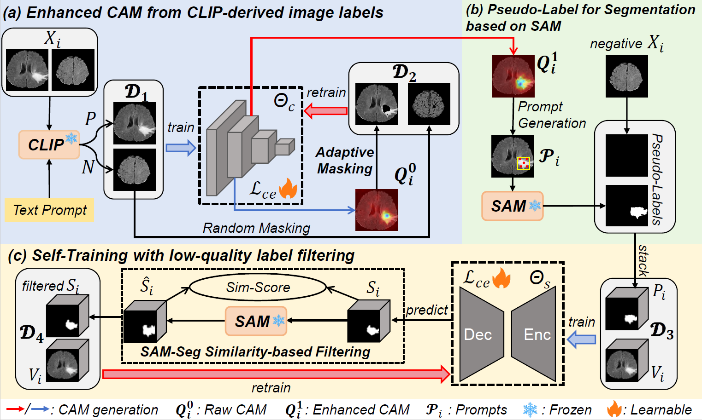
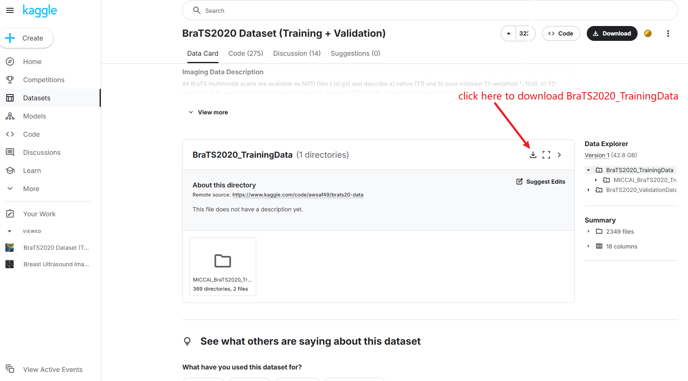

# Accepted by ISBI 2025
# CLISC: Bridging CLIP and SAM by Enhanced CAM for Unsupervised Brain Tumor Segmentation

## Structure


In this paper, we propose a novel unsupervised brain tumor segmentation method by adapting foundation models (CLIP and SAM) rather than directly using them for inference. The contribution is three-fold. First, we propose a framework named **CLISC** that bridges CLIP and SAM by enhanced Class Activation Maps (CAM) for **unsupervised brain tumor segmentation**, where image-level labels obtained by CLIP is used to train a classification model that obtains CAM, and the CAM  is used to generate prompts for SAM to obtain pseudo segmentation labels.  Second, to obtain high-quality prompts, we propose an **Adaptive Masking-based Data Augmentation (AMDA) strategy** for improved CAM quality. Thirdly, to reject low-quality segmentation pseudo-labels, we propose a **SAM-Seg Similarity-based Filtering (S3F) strategy** in a self-learning method for training a segmentation model. Evaluation on the BraTS2020 dataset shows that our method outperforms five state-of-the-art unsupervised segmentation methods by more than 10 percentage points with an average DSC of 85.60\%. Besides, our approach outperforms zero-shot SAM inference, achieving performance on par with fully supervised learning.


## How to use
Click [here](https://dl.fbaipublicfiles.com/segment_anything/sam_vit_b_01ec64.pth) download sam vit-b checkpoint and place it at "./checkpoint"
### 1. Environment
```sh
conda create -n CLISC python=3.10 
pip3 install torch torchvision torchaudio --index-url https://download.pytorch.org/whl/cu124
cd CLISC
pip install -e . ./CLIP ./segment-anything/ ./pytorch-grad-cam/
```

### 2. Dataset and Preprocessing
We use the **BraTS2020_TrainingData** to evaluate the effectiveness of our framework. A total of 369 cases are split into training, validation, and test sets with a ratio of 7:1:2, which are shown in "data/BraTS2020/splits"
#### Data Download choice 1: preprocessed data (Recommeded)
click [here](https://drive.google.com/drive/folders/1Vu2JwiSvIKAJ9NSDn-Q7coAq3J_HejCH?usp=drive_link) to download the processed data and place it as follows: "./data/BraTS2020/image" and "./data/BraTS2020/label" 

#### Data Download choice 2: raw data and run preprocessing
click [here](https://www.kaggle.com/datasets/awsaf49/brats20-dataset-training-validation) to download the raw data


and **place it as**: 
```py
"./data/raw_data/BraTS2020_TrainingData"
```
Note that you need to rename the seg file in BraTS20_Training_355 "W39_1998.09.19_Segm.nii" to "BraTS20_Training_355_seg.nii" like others to ensure that there are no problems with preprocessing.
**Then run data preprocess**.
```sh
python ./data/BraTS2020/preprocessing.py
```


### 3. Training

```sh
cd train
python step0_get_clip_label.py

python step1-1_train_res50.py --stage "raw"
python step1-2_get_Layercam.py --stage "raw"
python step1-3_AMDA.py 
python step1-1_train_res50.py --stage "aug"
python step1-2_get_Layercam.py --stage "aug"

python step2_sam_inference.py

python step3-1_train_UNet3D.py --training_csv "../data/BraTS2020/splits/train.csv" --exp "SAM_Sup"
python step3-2_UNet_reget_pseg.py
python step3-3_S3F.py
python step3-1_train_UNet3D.py --training_csv "../data/BraTS2020/splits/top_80_percent.csv" --exp "UNet_Sup"
```

### 4. Test
```sh
python test_3D.py --stage "test"
```


## Citation 
```bash
@article{ma2025clisc,
  title={CLISC: Bridging clip and sam by enhanced cam for unsupervised brain tumor segmentation},
  author={Ma, Xiaochuan and Fu, Jia and Liao, Wenjun and Zhang, Shichuan and Wang, Guotai},
  journal={arXiv preprint arXiv:2501.16246},
  year={2025}
}
```